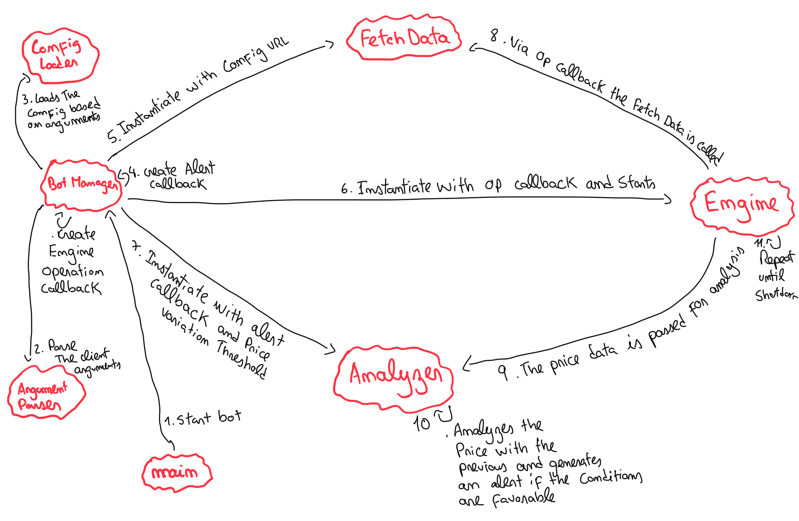

# uphold-bot

## Currency Price Oscillation Bot

A Node.js bot that monitors currency price oscillations using the [Uphold API](https://uphold.com/en/developer/api/documentation/), and triggers alerts when price changes exceed a configurable threshold.

---

## Features

- **Monitors currency pairs** (e.g., BTC-USD) for price changes.
- **Configurable price oscillation threshold** for alerts.
- **Pluggable alert callback** (default: logs to console).
- **Modular, extensible architecture** (analyzers, engines, fetchers).
- **Tested with Jest** and includes unit tests.

---

## Table of Contents

- [Installation](#installation)
- [Usage](#usage)
- [Configuration](#configuration)
- [Architecture](#architecture)
- [Development](#development)
- [Example Output](#example-output)
- [Future Work](#future-work)

---

## Installation

1. **Prerequisites:**

Make sure node and npm are installed in your machine. Node version **>v20**.

2. **Clone the repository:**

```sh
git clone git@github.com:jnunomcosta/uphold-bot.git
cd uphold-bot
```

3. **Install Dependencies:**

```sh
npm install
```

## Usage

Start the bot with (this uses a default configuration):

```sh
npm run start
```

To start the bot with a custom configuration simply pass the configuration file like this:

```sh
npm run start -- --config /path/to/your/config
```

To stop the bot the SIGINT signal (crtl+c) can be used.

## Configuration

To configure the bot execution, it needs a json file passed as argument. With the backend url and one or more currencies to track like the following example:

```json
{
    "url": "https://api.uphold.com/v0/ticker/",    // Uphold URL.
    "currenciesToTrack": [
        {
            "currencyPairTicker": "BTC-USD",       // Currency Ticker
            "fetchInterval": 5000,                 // Fetch interval in milliseconds (ms)
            "priceOscillationPercentage": 0.001    // Price oscillation threshold (%) 
        },
        {
            "currencyPairTicker": "BTC-EUR",
            "fetchInterval": 5000,
            "priceOscillationPercentage": 0.005
        },
        {
            "currencyPairTicker": "BTC-ETH",
            "fetchInterval": 2500,
            "priceOscillationPercentage": 0.01
        },
        {
            "currencyPairTicker": "USD-EUR",
            "fetchInterval": 1000,
            "priceOscillationPercentage": 0.00001
        }
    ]
}
```

- **url:** Uphold API endpoint.
- **currencyPairTicker:** Currency pair to monitor.
- **fetchInterval:** Fetch interval (ms).
- **priceOscillationPercentage:** Minimum price change to trigger alert (as a decimal).

## Architecture

- **src/analyzer/:** Price analysis and alerting logic.
  - ``PriceAnalyzer.js:`` Detects significant price changes.
  - ``AnalyzeManager.js:`` Manages analyzers for multiple pairs.
  - ``PriceAlert.js:`` Alert data structure.
- **src/backendConnection/:** Fetches data from Uphold API.
  - ``FetchData.js:`` HTTP GET with timeout.
- **src/engine/:** Scheduling and orchestration.
  - ``Engine.js:`` Periodic task runner.
  - ``EngineManager.js:`` Manages multiple engines.
- **src/argumentParser/:** Argv argument parsing.
  - ``ArgumentParser.js:`` Parses argv data.
- **src/configLoader/:** Configuration loader.
  - ``ConfigLoader.js:`` Reads the configuration file and asserts the content.
- **src/botManager/:** Manages all the components of the bot.
  - ``BotManager.js:`` Instantiates every class and callback. Orchestrates the program.
- **src/main.js:** Entry point of the bot.

The following is a manually made entity diagram that attempts to show how the various entities communicate with each other.


## Development

- Lint code:

```sh
npm run lint
```

- Testing:

Test Framework: Jest
Run all tests and get coverage report:

```sh
npm run test
```

## Example Output

``
New Price Alert 🚨 on BTC-USD! Price at: 109623.0791731246, variation of -0.0128% previous alert price: 109637.1122434467 with timestamp: 1757004000464
``

## Future Work

Some TODOs were left throughout the code to indicate future feature expandability of the bot. Such as:

- Support API authentication.
- Changing Engine Execution Type. Stopping and starting engines during execution.
- Supporting different alert types, such as database writes.
- Supporting more

The application can be dockerized by creating a Dockerfile file, with a node image, mounting the project code,
installing the dependencies and executing docker run passing the desired configuration. In the future the
config can be provided via an environment variable to facilitate runnability.

A postgres database can be integrated, creating a table for "Bot Config" with a url and ticker as primary keys
and the rest of the bot configuration as data, fetch interval, oscillation, etc. Then in each alert we would
have our own alert table and have the reference to the respective bot config and write that alert into its own
table with the price alert information.
For example the "pg" module could be used to create the necessary tables in the database and write the necessary
data there.

Everything could later be joined using docker-compose, to set up the database container and the bot container,
and run both programs.
